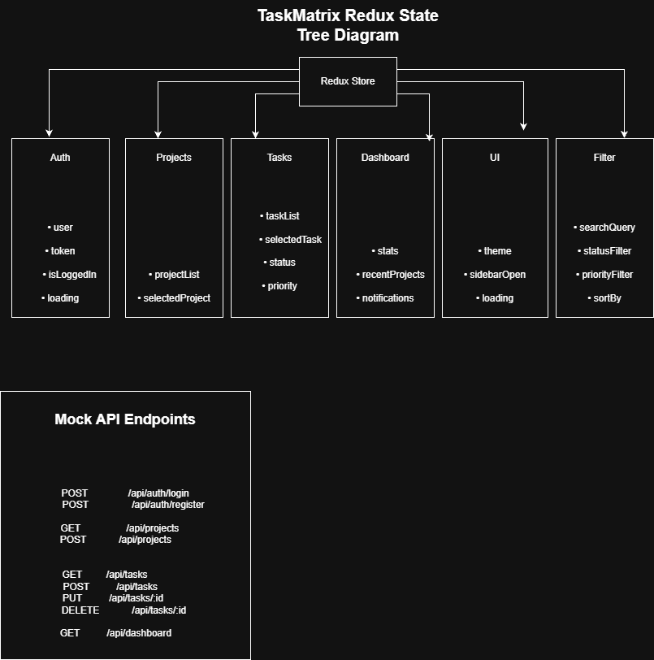

# prodesk-capstone-taskmatrix
#  TaskMatrix

> **An Enterprise-Grade Agile Project Management Application**

TaskMatrix is a modern Agile Project Management platform inspired by tools like **Jira** and **Asana**. It is designed to help software teams efficiently manage projects, organize tasks, collaborate with team members, and track progress through an intuitive Kanban-based workflow.

This project is being developed as part of the **ProdeskIT Engineering Capstone Phase**, following an industry-standard software development lifecycle. This repository currently contains the **Product Requirements Document (PRD)**, UI/UX planning, and frontend architecture blueprint.

---

# Designated Track

**Frontend Engineering**

---

#  Project Objectives

The goal of TaskMatrix is to build a scalable and user-friendly project management application that enables teams to:

- Manage multiple projects
- Organize tasks using Kanban boards
- Assign tasks to team members
- Track project progress
- Prioritize work efficiently
- Improve team collaboration
- Provide a responsive and modern user experience

---

#  Tech Stack

| Category | Technology |
|----------|------------|
| Framework | Next.js 15 |
| Language | JavaScript (ES6+) |
| Styling | Tailwind CSS |
| State Management | Redux Toolkit |
| HTTP Client | Axios |
| Drag & Drop | DnD Kit |
| Icons | Lucide React |
| Notifications | React Hot Toast |
| Testing | Jest + React Testing Library |
| Component Development | Storybook |
| Version Control | Git & GitHub |
| Deployment | Vercel |

---

# Core Features

## P0 (Must Have)

- User Authentication UI
- Dashboard
- Workspace Management
- Kanban Board
- Task Creation
- Task Assignment
- Task Details View
- Responsive Design

## P1 (Should Have)

- Search Tasks
- Filters
- Priority Tags
- Labels
- Due Dates
- Notifications
- Team Members

## P2 (Nice to Have)

- Calendar View
- Activity Timeline
- Analytics Dashboard
- Dark Mode
- User Profile
- Settings

---

#  Target Users

- Software Developers
- Project Managers
- Team Leads
- QA Engineers
- Startup Teams
- Freelancers

---

#  UI/UX Wireframes

The UI has been designed before development following enterprise product design practices.

### Planned Screens

- Login Page
- Dashboard
- Kanban Board

## Figma Design

**Figma Link:**  
(https://www.figma.com/design/R5Y9e9VttTwrUxxMtQBlMW/TaskMatrix---Capstone?node-id=0-1&t=JC7ZsdlELE4dtpvE-1)

---
## UI Screens

### Login Page


### Dashboard


### Kanban Board


-----

# Planned Folder Structure

```text
src/
│
├── app/
├── components/
│   ├── auth/
│   ├── dashboard/
│   ├── kanban/
│   ├── navbar/
│   ├── sidebar/
│   └── common/
│
├── redux/
│   ├── store.js
│   └── features/
│
├── services/
├── hooks/
├── utils/
├── constants/
├── assets/
└── styles/
```

---

# State Management Architecture

Redux Toolkit will be used to manage global application state.

### Planned State Tree

```text
Store
│
├── auth
├── projects
├── tasks
├── users
├── filters
└── ui
```

### Redux State Diagram



---

# Planned Mock API Endpoints

### Authentication

```http
POST /api/login
POST /api/register
POST /api/logout
GET  /api/profile
```

### Projects

```http
GET    /api/projects
GET    /api/projects/:id
POST   /api/projects
PATCH  /api/projects/:id
DELETE /api/projects/:id
```

### Tasks

```http
GET    /api/tasks
GET    /api/tasks/:id
POST   /api/tasks
PATCH  /api/tasks/:id
DELETE /api/tasks/:id
PATCH  /api/tasks/move
```

### Users

```http
GET /api/users
GET /api/users/:id
```

---

#  Development Roadmap

### Week 1
- Product Planning
- PRD Documentation
- Wireframes
- State Architecture

### Week 2
- Authentication
- Dashboard
- Layout Development

### Week 3
- Kanban Board
- Task Management
- State Integration

### Week 4
- Advanced Features
- Testing
- Performance Optimization

### Week 5
- Deployment
- Documentation
- Final QA
- Presentation

---

# Project Goals

- Build an enterprise-level frontend application.
- Follow modern UI/UX principles.
- Create a scalable component architecture.
- Implement efficient state management.
- Deliver a responsive and accessible user interface.

---

# Current Sprint Status

✅ Product Requirements Document (PRD)

✅ UI/UX Wireframes

✅ Frontend Architecture Planning

⬜ Application Development

⬜ Testing

⬜ Deployment

---

# 📄 License

This project is developed as part of the **ProDesk Engineering Capstone Program** for educational and portfolio purposes.
